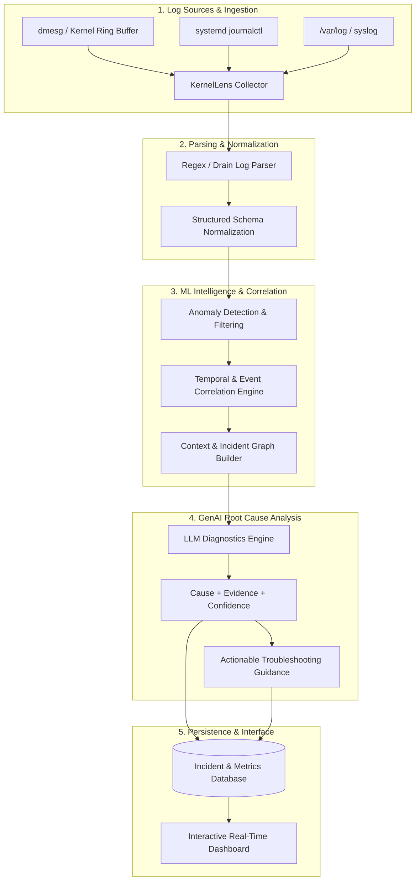

# KernelLens AI 🔍🐧

> **Intelligent Linux Kernel Log Diagnostics & Automated Root Cause Analysis Platform**

KernelLens AI is an end-to-end telemetry intelligence system designed to ingest, parse, correlate, and diagnose Linux kernel and system logs in real time. Combining machine learning anomaly detection with LLM-powered root cause analysis (RCA), KernelLens transforms noisy raw logs into actionable incident evidence, confidence-scored diagnostics, and targeted remediation steps.

---

## 🏛️ System Architecture



---

## 🔄 Development & Git Workflow

This repository enforces a strict **3-tier branch architecture** maintained by our 3-developer team and AI agent:

```
main (Production & Final Submission Only)
 └── develop (Permanent Integration Branch)
      ├── feature/log-collector
      ├── feature/log-parser
      ├── feature/anomaly-classifier
      ├── feature/event-correlation
      ├── feature/fastapi-backend
      ├── feature/llm-analysis
      ├── feature/dashboard
      └── ...
```

### Key Workflow Rules:
1. **Never code directly on `main` or `develop`.**
2. Feature branches branch from the latest `develop`: `feature/<feature-name>`.
3. Pull Requests always target **`develop`**.
4. **Merge Authority:** Only the repository maintainer (**Shreyans Chowdry**) merges Pull Requests into `develop`.
5. Automatic branch deletion cleans up merged feature branches.
6. `develop` merges into `main` only upon final project release.

Full guidelines are codified in [`AGENTS.md`](./AGENTS.md) and [`.agents/rules/git-workflow.md`](./.agents/rules/git-workflow.md).

---

## 👥 Project Team & Maintainers
- **Repository Maintainer & Owner:** Shreyans Chowdry
- **Development Team:** 3-member team vibe coding with Antigravity
